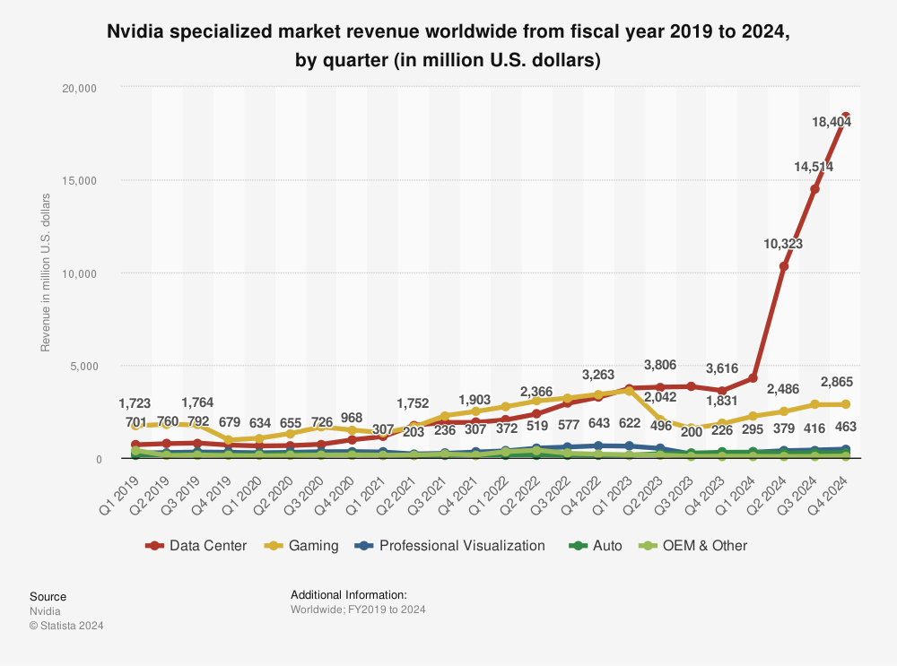

#  Case Study

## Overview and Origin

The company is Nvidia and it was incorporated on April 5, 1993. The founders of the company are Jensen Huang, Chris Malachowsky, and Curtis Priem. They had the idea to create the company while discussing a vision of the future which was so compelling that Huang decided to leave LSI and become the chief executive officer of their new startup. The company was funded with $20 million of venture capital funding from Sequoia Capital and others.
>"Founded on April 5, 1993, by Jensen Huang, Chris Malachowsky, and Curtis Priem, with a vision to bring 3D graphics to the gaming and multimedia markets."
[Quote from NVIDIA.com](https://www.nvidia.com/en-us/about-nvidia/corporate-timeline/)

This path was chosen due to its unique ability to tackle challenges that eluded general-purpose computing methods. Huang was particularly interested in video games as they were simultaneously one of the most computationally challenging problems and would have incredibly high sales volume. Soon, Nvidia released their first GPU and became known as the standard for graphic processing units in 2001 thanks to the company's success in developing, marketing its processors and its impact on the consumer video game market. NVIDIA’s customers were mostly comprised of gamers, developers, data centers and startups who needed powerful computing solutions. In 2009 however, NVIDIA began developing for deep learning and AI capable GPUs. Its first AI and deep learning GPU were released in 2016, these GPUs were very expensive and mostly used in data center uses, they were made available through [Google cloud](https://techcrunch.com/2018/08/06/google-cloud-gets-support-for-nvidias-tesla-p4-inferencing-accelerators/), Microsoft Azure, and Amazon Web Services. These GPUs featureed tensor cores, which is NVIDIA newly developed processing units that are optimized for deep learning and artificial intelligence workloads. Then, in 2018, NVIDIA released its first lineup of [RTX GPUs](https://blogs.nvidia.com/blog/gamescom-rtx-turing-real-time-ray-tracing/) for gaming to the masses. These GPUs feature the same tensor cores that NVIDIA developed a few years before which allow gamers to now benefit from AI enhanced features such as: super resolution and [deep learning super sampling or dlss](https://en.wikipedia.org/wiki/Deep_learning_super_sampling). 

## Business Activities

Today, NVidia’s focus remains pretty much the same as before which is bringing more efficient and powerful graphic processing unit solutions to large companies, startups, developers and consumers while showering them with new AI features. While NVIDIA has been providing deep learning and AI solutions for both companies needing a data center and gamers, the artificial intelligence field has seen a tremendous increase in popularity over the past two years as open AI came up with Chat GPT and demonstrated the power of AI to the masses. 
This resulted in the demand for powerful GPUs capable of Processing this type of data to skyrocket as well. AI, deep learning and large language models have been implemented and led innovation in many domains such as:

* Transportation (self driving cars, aviation)
* Healthcare
* Finance
* Design
* Speech recognition
* Computer vision
* natural language processing

>"The Cambridge-1 supercomputer will serve as a hub of innovation for the UK, and further the groundbreaking work being done by the nation's researchers in critical healthcare and drug discovery." 
[Huang in his 2020 keynote](https://www.cnbc.com/2020/10/05/nvidia-pledges-to-build-britains-largest-supercomputer.html)

While Nvidia's growth has been exponential in the data center market since the rise of AI, it's major competitor in the GPU market, Qualcomm, AMD and Intel have been nowhere to be seen in the AI field until very recently. 

[Graph above sourced from the globe and mail](https://www.theglobeandmail.com/investing/markets/stocks/NVDA-Q/pressreleases/24598851/this-trend-could-signal-more-gains-for-nvidia/)

NVIDIA’s early investment in neural networks, deep learning and AI has given them a tremendous advantage in development, supply chain and clients. Only very recently has Qualcomm and AMD have their AI NPU (neural processor units) been announced for consumers at the last Microsoft conference for their new line up of [copilot + laptops](https://www.cnet.com/tech/computing/everything-microsoft-just-announced-copilot-plus-pcs-surface-pro-and-laptop-running-on-qualcomm/), however in terms of raw processing power they are still far behind NVIDIA. The same can be said in terms of sales as NVIDIA is now selling their latest extremely powerful GPUs for data centers by the millions to companies like [Meta](https://www.cnbc.com/2024/01/18/mark-zuckerberg-indicates-meta-is-spending-billions-on-nvidia-ai-chips.html), Open AI, and Tesla. As of March 2024, Nvidia's market capitalization was valued at over $3 trillion.

## Results

Nvidia Corporation has had a significant impact on the technology industry and the broader market since its founding in 1993. The company has been a leader in the development and production of graphics processing units (GPUs) and other technologies and has played a key role in shaping the evolution of the gaming, professional, and consumer markets.
Nvidia's early success in the gaming market, with products such as the GeForce 256 and the Shield Portable, helped to establish the company as a major player in the gaming industry. The company's expansion into other markets, such as professional computing, supercomputing, and artificial intelligence, has also been successful, with products such as the Tesla V100 and the A100 AI supercomputer gaining widespread adoption. Nvidia's latest Data Center GPU, the extremely powerful [H100 were released end of 2022](https://en.wikipedia.org/wiki/Hopper_(microarchitecture)) and are so popular that other CEOS were begging for them.

>“An hour of sushi and begging.”
[quote from banyanhill](https://banyanhill.com/billionaires-elon-musk-larry-ellison-beg-for-ai-chips-over-sushi/)

As a result, NVIDIA GPUs make up for 80% of the market. 
NVIDIA’s financial performance is very strong and growing steadily. It is now the third most valuable company in the world.

## Recommendations

An interesting area for nvidia to undertake would be smarthomes. Homes are getting smarter than ever in the sense that you have lights, thermostats, security systems, tvs, speakers, sprinklers, pools and whole bunch of devices connected together. These devices are connected trough a hub or a device that acts as such, like phillips hue or apple home. While the word smart is used to describe those types of homes, they aren't. The conditions for the activation of a device or a specific setting are pre programed based on few different factors, time, temperature, humidity..etc. However, with machine learning and especially nvidia's gpus, the home has the opportunity to become truly smart. Picture a server or data center in your home that can manage all of your devices while learning of everyone's habit, with the use of cameras and microphones, it could take specific actions and anticipace the next one based on contexts. Now, the idea of micophones and cameras at home can be scary, but that is the point of the data center at home. The data remains localized and only for training purposes, and after that it is deleted. I believe this would go far in terms of practicality and efficiency of the home. For exemple, the water heater could activate only when the home anticipate that it is necessary or by voice command. Or the home could tell you if there is a delivery person outside and from what company, it could even answere the door for you in a siri like manner. There is so much it could do for the homeowner.

## Sources

* https://en.wikipedia.org/wiki/Nvidia

* https://www.nvidia.com/en-us/about-nvidia/corporate-timeline/

* https://techcrunch.com/2018/08/06/google-cloud-gets-support-for-nvidias-tesla-p4-inferencing-accelerators/

* https://blogs.nvidia.com/blog/gamescom-rtx-turing-real-time-ray-tracing/

* https://en.wikipedia.org/wiki/Deep_learning_super_sampling

* https://www.cnbc.com/2020/10/05/nvidia-pledges-to-build-britains-largest-supercomputer.html

* https://www.theglobeandmail.com/investing/markets/stocks/NVDA-Q/pressreleases/24598851this-trend-could-signal-more-gains-for-nvidia/

* https://www.cnet.com/tech/computing/everything-microsoft-just-announced-copilot-plus-pcs-surface-pro-and-laptop-running-on-qualcomm/

* https://www.cnbc.com/2024/01/18/mark-zuckerberg-indicates-meta-is-spending-billions-on-nvidia-ai-chips.html

* https://en.wikipedia.org/wiki/Hopper_(microarchitecture)

* https://banyanhill.com/billionaires-elon-musk-larry-ellison-beg-for-ai-chips-over-sushi/